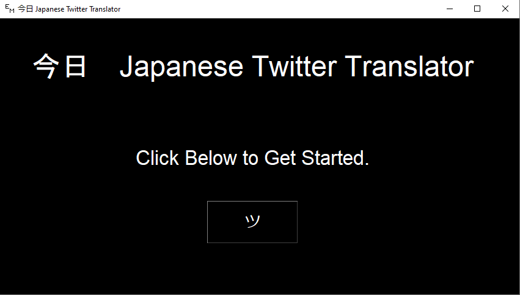
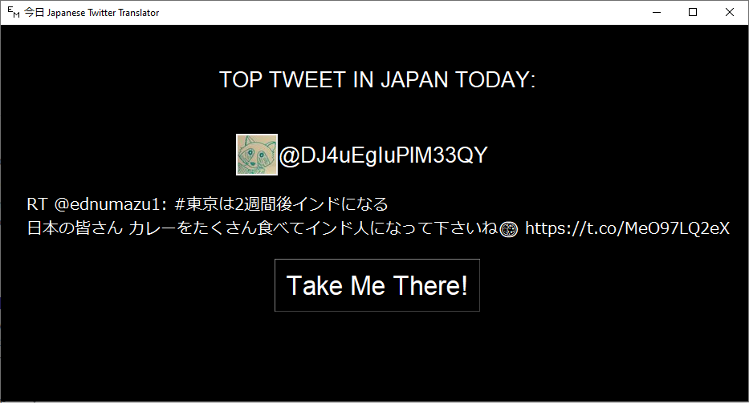

# Kyo
Using the Twitter API, this program finds a top trending Tweet from Japan when requested.  The program shows the Tweet in Japanese along with the profile name and picture, and it links to the Tweet's URL where it can be translated.

This project was to learn the Python programming language through a fun and relevant experience to me.

This shows the front screen when the program is opened.

Here is a Tweet along with its user:

